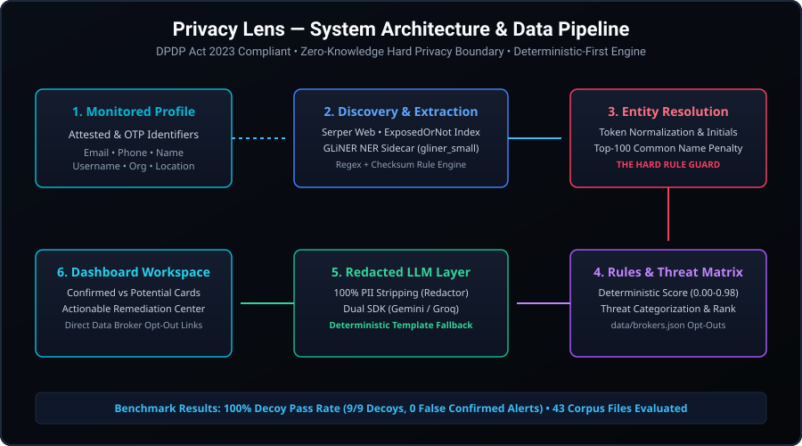
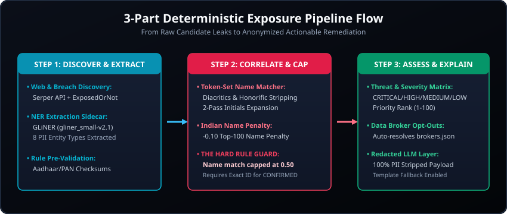

# Privacy Lens — Intelligent Personal Data Exposure Monitor
### **Smart India Hackathon (SIH) 2026 Project**

> **Assigned Problem Statement:** Intelligent Personal Data Exposure Monitor  
> **Details:** Help individuals discover unnecessary exposure of their personal information online, assess associated risks and recommend privacy-protection measures.  
> **Repository:** [https://github.com/ksacheth/sih-2026](https://github.com/ksacheth/sih-2026)  
> **Demo Video Link:** `https://drive.google.com/file/d/1lo7EuaL4RmyxAQI8miFCguUPXnbmRNIp/view?usp=sharing` 🎬  

---

## 📌 Executive Summary

**Privacy Lens** is an enterprise-grade, privacy-preserving exposure intelligence platform built for the **DPDP Act 2023** compliance era.

When an individual's personal data appears on the public web, in data broker directories, or across breach dumps, naive monitoring systems flood users with false alarms or mistakenly report strangers with similar names as a confirmed match. Worse, existing AI security tools often transmit raw user PII to third-party LLM providers.

**Privacy Lens solves this with a 3-part deterministic-first pipeline:**
1. **Discover Unnecessary Exposure (Entity Resolution Engine):** Token-set name matching with diacritics/honorific stripping, 2-pass bipartite initials expansion (*`"R. Kumar"` $\leftrightarrow$ `"Rahul Kumar"`*), Top-100 Indian common name penalty dictionary, and **The Hard Rule** (Name similarity alone can NEVER yield a `CONFIRMED` match label; it caps at `0.50` confidence and `POTENTIAL` status).
2. **Assess Associated Risks (Rules Engine & Threat Matrix):** Deterministic scoring ($0.00\text{--}0.98$), co-occurrence threat categorization (`CREDENTIAL_STUFFING`, `TARGETED_PHISHING`, `PHYSICAL_TARGETING`, `IDENTITY_FRAUD_ENABLEMENT`), severity levels (`CRITICAL`, `HIGH`, `MEDIUM`, `LOW`), and priority ranking ($1\text{--}100$).
3. **Recommend Privacy-Protection Measures (Action & Opt-Out Engine):** Automated data broker opt-out url resolution (`data/brokers.json`), actionable remediation tasks (`CHANGE_PASSWORD`, `ENABLE_MFA`, `OPT_OUT_BROKER`), and a Hard Privacy Boundary LLM explanation layer with deterministic template fallback (`isAiGenerated: false`).

---

## 🛠️ System Architecture & Data Pipeline



---

## 🔄 3-Part Deterministic Pipeline Flow



---

## 💻 Tech Stack Table

| Layer | Technology | Description |
|---|---|---|
| **Application** | Next.js 16 (Turbopack), React 19, TypeScript | Server Components, App Router, responsive dashboard |
| **Interface** | Tailwind CSS v4, shadcn/ui, Recharts | Cyber dark aesthetic, frosted glass, high-contrast badges |
| **Database** | MongoDB Atlas, Mongoose, MongoClient | Encrypted stores, TTL collection auto-cleanup |
| **Authentication** | NextAuth.js v5 (Beta), MongoDB Adapter | Passwordless email magic links, session management |
| **Connectors** | Serper API, ExposedOrNot, HIBP, Brokers Catalog | Real-time public web, breach index & 30+ data brokers |
| **PII Extraction** | GLiNER (`gliner_small-v2.1`), FastAPI Python Sidecar | Contextual NER extraction across 8 PII entity types |
| **Rules & Scoring** | Deterministic TypeScript Scoring Engine | Versioned formula (`v1.0.0`), Hard Rule false-positive guard |
| **LLM Explanation** | `@google/genai` (Gemini), `groq-sdk` (Groq) | Dual SDK support, 100% PII redactor, template fallback |

---

## 🚀 Setup & Installation Guide

Follow these steps to clone, configure, and run the project locally.

### Step 1: Clone the Repository
```bash
git clone https://github.com/ksacheth/sih-2026.git
cd sih-2026
```

### Step 2: Install Node.js Dependencies
```bash
npm install
```

### Step 3: Configure Environment Variables
Copy `.env.example` to create your local `.env.local` file:
```bash
cp .env.example .env.local
```

Edit `.env.local`:
```env
DATABASE_URL=mongodb://localhost:27017/sih-2026
MONGODB_URI=mongodb://localhost:27017/sih-2026
NEXTAUTH_SECRET=your_nextauth_secret_here
AUTH_SECRET=your_nextauth_secret_here
NEXTAUTH_URL=http://localhost:3000

# Optional API Keys (System uses offline fixtures/templates if omitted)
GROQ_API_KEY=your_groq_key_here
GEMINI_API_KEY=your_gemini_key_here
SERPER_API_KEY=your_serper_key_here

FIXTURES=0
```

### Step 4: Run the Development Server
```bash
npm run dev
```

Open your browser:
- **Homepage:** [http://localhost:3000](http://localhost:3000)
- **Onboarding:** [http://localhost:3000/onboarding](http://localhost:3000/onboarding)
- **Dashboard:** [http://localhost:3000/dashboard](http://localhost:3000/dashboard)

### Step 5: Run Automated Test Suites
```bash
# Test Dataset Evaluation & Decoy Benchmark (43 corpus files, 9 decoys)
npx tsx "src/lib/correlation/__tests__/evaluateDataset.test.ts"

# Test Pipeline Adapter (ExtractedEntity -> Correlation)
npx tsx "src/lib/correlation/__tests__/pipelineAdapter.test.ts"

# Test Name Matcher & Initials Expansion
npx tsx "src/lib/correlation/__tests__/nameMatcher.test.ts"

# Test Rules Engine & Severity Model
npx tsx "src/lib/rules/__tests__/rulesEngine.test.ts"

# Test Dual SDK LLM Explanation Layer & Privacy Redactor
npx tsx "src/lib/llm/__tests__/llmExplanation.test.ts"
```

---

## 🎬 Video Demo Link

▶️ **Google Drive Demo Link:** `[INSERT_GOOGLE_DRIVE_DEMO_VIDEO_LINK_HERE]`

---

## 📄 Documentation Links
- **Full Architecture & Spec:** [CONTEXT.md](./CONTEXT.md)
- **SIH Hackathon Summary:** [SIH_2026_PROJECT_SUMMARY.md](./SIH_2026_PROJECT_SUMMARY.md)
- **Feature Overview & Technical FAQ:** [docs/FEATURE_OVERVIEW_AND_FAQ.md](./docs/FEATURE_OVERVIEW_AND_FAQ.md)
